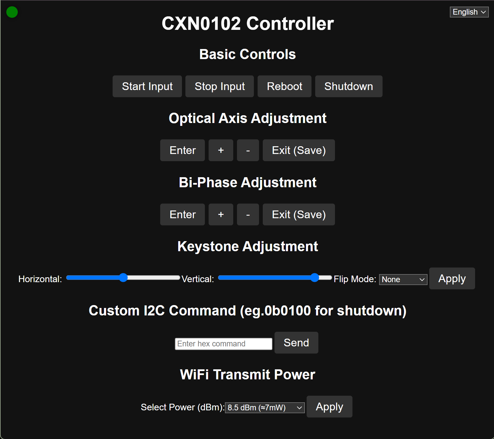

# cxn0102projector_controller_esp32c3_supermini
 - 中文：[Readme_chinese.md](Readme_chinese.md)
 - connections（接线图和页面说明）：
> **🚀 Important Notice:**
> recommend version: v3.2
> The binary files provided in this project require a purchased license.  
> If you have your own **ESP32-C3 SuperMini** development board, you can get a **50% discount**.(2.41$)  
> The project **may be open-sourced soon**.

## 🛒 Purchase License

- **Purchase Link:**  
  👉 [Click here to purchase the license](https://m.tb.cn/h.6UebzQ8?tk=tanMeCCtX1U)
  
- **Contact:**  
  📩 If you have any questions, please email: **`Zephyr142024@gmail.com`**

---

## 🔥 How to Download and Flash the Binary Files

Follow the detailed steps below to flash the binary files onto your ESP32-C3 development board using the **ESP32 Flash Download Tool**.

### 1️⃣ Download the ESP32 Flash Download Tool

- **Official Download:**  
  Visit the [Espressif Documentation](https://docs.espressif.com/projects/esp-test-tools/en/latest/esp32/production_stage/tools/flash_download_tool.html) to get the tool.

- **Repository Download:**  
  The tool is also available in this project's directory:  
  📂 `cxn0102projector_controller_esp32c3_supermini/download_tool`

### 2️⃣ Obtain the Correct Binary File

- Download the **.bin** file that matches your device from the available resources.

### 3️⃣ Set Up the Flashing Tool

- **Open the ESP32 Flash Download Tool.**
- **Configure the following settings:**
  - **Chip Type:** `ESP32-C3`
  - **Firmware Mode:** `Development`
  - **Interface:** `UART`

### 4️⃣ Configure and Flash the Firmware

- **Use Default Settings:**  
  No need to modify default configurations in most cases.

- **Flash Address:**  
  Burn the binary file to the chip at address **`0x0`**.

- **Start Flashing:**  
  Click **"Start Flash"** or **"Download"**, then wait for the process to complete.

### 5️⃣ Verify and Restart

- After flashing is complete, you should see a **"Flash Successful"** message.
- **Restart your ESP32-C3 SuperMini** to apply the new firmware.

---

## 🆕 Updates & Version History

### **🔹 v3.2 (Test)**
- ✅ **Added:** gpio2 button for shuttingdown

### **🔹 v3.1 (Latest Release)**
- ✅ **Added:** Chinese
- ✅ **Added:** changed wiring layout!!!!

📸 **Screenshot:**  

### **🔹 v3.0**
- ✅ **Added:** Custom I2C Commands  
- ✅ **Added:** WiFi Transmit Power Settings  

📸 **Screenshot:**  
%20-%20Google%20Chrome%202_15_2025%2012_36_12%20PM.png)

### **Previous Versions**
- **v2.0, v2.2, v2.3** are **not shown here**.  
  📩 **Contact me if you need these versions!**

---

📌 If you have any issues or need assistance, feel free to reach out via email.  
🎉 **Happy flashing!**
