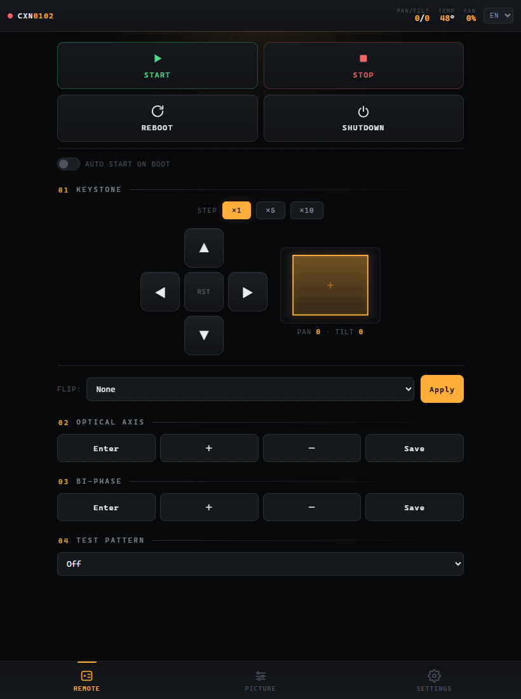

# CXN0102 Projector Controller for ESP32-C3 SuperMini

[中文说明](Readme_chinese.md) · [Latest V4.3 source and binaries](v4.3/) · [Original wiring diagram](figures/Esp32c3_supermini_wiring.png) · [Image archive](figures/README.md)

An open-source Wi-Fi and I²C controller for CXN0102 projector modules, built for the ESP32-C3 SuperMini. V4.3 provides a responsive bilingual web interface, projector controls, temperature monitoring, configurable thermal shutdown, and optional fan control.

> [!IMPORTANT]
> This project is fully open source and does not require a license key. The Waveshare ESP32-C3-Zero/mini boards are recommended where possible. Some low-cost SuperMini clones have poorly tuned antennas; verify the GPIO labels before wiring.

> [!WARNING]
> `COM_REQ` appears to be an open-drain signal. Connect GPIO10 with an external pull-up; approximately **5 kΩ** is known to work. Without a working `COM_REQ`, normal I²C commands and periodic reads can still work, but asynchronous projector notifications may be missed.

## V4.3 interface



## V4.3 highlights

- Responsive English/Chinese web interface for phones and desktop browsers.
- Start, stop, reboot, shutdown and optional auto-start.
- Keystone, image flip, optical-axis and bi-phase adjustment.
- Picture-quality controls, built-in test patterns and validated custom I²C commands.
- AP and STA Wi-Fi modes with saved-network management.
- Projector temperature and ESP32-C3 die-temperature history for the latest hour.
- Configurable high-temperature shutdown with two-sample confirmation.
- Fan curves, full-speed mode, custom curve, PID control and PID auto-tuning.
- **Fan Off** mode for fanless, heatsink-only devices; temperature history and thermal shutdown remain active.
- Projector temperature thresholds, run time, firmware/data versions, LOT and serial-number display.
- Settings persistence in EEPROM/NVS.
- ESP32-C3 CPU reduced to 80 MHz and Wi-Fi power-saving adjustments.

The delivered firmware and browser simulations pass locally. Real-hardware COM_REQ timing, fan PWM and deliberate thermal-shutdown triggering still require validation on the target device.

## Wiring


The original wiring image remains the primary connection reference. Confirm voltage levels, grounds and pin labels for your exact controller board before powering the hardware.

| ESP32-C3 pin | Function |
|---|---|
| GPIO8 | I²C SDA |
| GPIO7 | I²C SCL |
| GPIO10 | COM_REQ input; external pull-up recommended |
| GPIO2 | Long-press shutdown button, active low |
| GPIO6 | 25 kHz fan PWM output |

The projector I²C address used by V4.3 is `0x77`. Confirm voltage levels, grounds and pin labels for your exact controller board before powering the hardware.

## First connection

After flashing and restarting the ESP32-C3:

1. Connect to Wi-Fi network `CXN0102_Web_Controller_Silver`.
2. Enter the default password `12345678`.
3. Open `http://192.168.4.1/`.
4. Use the Wi-Fi section to save a local network and switch to STA mode if required.

The web controller has no user authentication. Do not expose it directly to the public internet, and change the compiled-in AP password before deployment if the default is unsuitable.

## Flash the prebuilt V4.3 firmware

### Simple method: merged image

Use Espressif's [Flash Download Tool](https://docs.espressif.com/projects/esp-test-tools/en/latest/esp32/production_stage/tools/flash_download_tool.html), or the archived copy under [`download_tool`](download_tool/).

Select `ESP32-C3`, `UART`, then flash:

| File | Address |
|---|---:|
| [`v4.3_merged_0x0.bin`](v4.3/bin/v4.3_merged_0x0.bin) | `0x0` |

The merged image contains the bootloader, partition table, application and SPIFFS web files. Flashing it may clear previously stored controller settings.

### Advanced method: separate images

| File | Address |
|---|---:|
| [`bootloader.bin`](v4.3/bin/bootloader.bin) | `0x0` |
| [`partitions.bin`](v4.3/bin/partitions.bin) | `0x8000` |
| [`firmware.bin`](v4.3/bin/firmware.bin) | `0x10000` |
| [`spiffs.bin`](v4.3/bin/spiffs.bin) | `0x290000` |

Verify downloads against [`SHA256SUMS.txt`](v4.3/bin/SHA256SUMS.txt). Do not flash only `firmware.bin` at address `0x0`; that instruction applies only to a merged image.

## Build from source

Install [Visual Studio Code](https://code.visualstudio.com/) with the PlatformIO extension, or PlatformIO Core. Then run from the `v4.3` directory:

```bash
pio run
pio run -t buildfs
```

To upload through PlatformIO:

```bash
pio run -t upload
pio run -t uploadfs
```

The project targets `esp32-c3-devkitm-1`, Arduino framework, 4 MB flash, DIO mode and SPIFFS. See [`v4.3/platformio.ini`](v4.3/platformio.ini) for the complete configuration.

## Thermal-safety notes

- Automatic high-temperature shutdown is disabled by default and must be configured deliberately.
- Default reference thresholds are 70 °C for the projector module and 85 °C for the ESP32-C3 die sensor.
- The first over-limit sample requests full fan output when a fan is enabled. Two consecutive valid over-limit samples trigger `Stop` followed by `Shutdown`.
- In Fan Off mode, PWM remains at zero but monitoring, history and shutdown logic continue.
- The ESP32-C3 sensor measures internal die temperature, not room or enclosure temperature.
- Software can request projector shutdown but cannot physically disconnect projector power.

See [`v4.3/POWER_V4.3.md`](v4.3/POWER_V4.3.md) for implementation and validation details.

## Repository layout

| Path | Description |
|---|---|
| [`v4.3/`](v4.3/) | Current source, web assets, tests and prebuilt binaries |
| [`v4.2/`](v4.2/) | Previous web-controller release |
| [`v3.4/`](v3.4/) | Earlier PlatformIO release |
| [`v3.0/`](v3.0/)–[`v3.2/`](v3.2/) | Historical binary releases |
| [`figures/`](figures/) | Wiring and interface images |
| [`download_tool/`](download_tool/) | Archived flashing utility |

## Version history

| Version | Main changes |
|---|---|
| V4.3 | Modular firmware, 80 MHz power optimization, improved Wi-Fi behavior, bilingual responsive UI, projector/ESP32 temperature histories, configurable thermal shutdown, expanded fan control and fanless mode |
| V4.2 | Web control, persistent settings and SPIFFS interface |
| V3.4 | PlatformIO source release and protocol reference |
| V3.2 | GPIO2 shutdown button |
| V3.1 | Chinese interface and revised wiring |
| V3.0 | Custom I²C commands and Wi-Fi transmit-power control |

## Historical interface screenshots

The existing V3.0 and V3.1 screenshots remain in the repository.


## License

See [`LICENSE`](LICENSE). Contributions and hardware-test reports are welcome.
