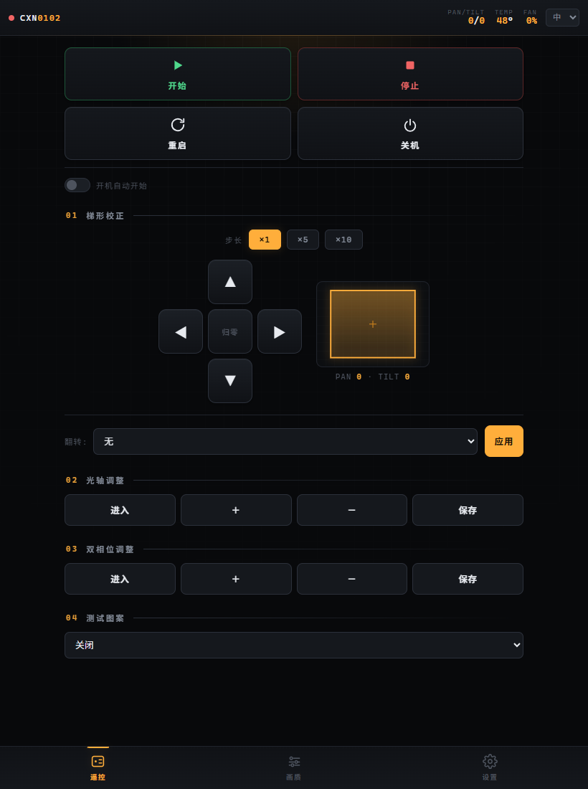
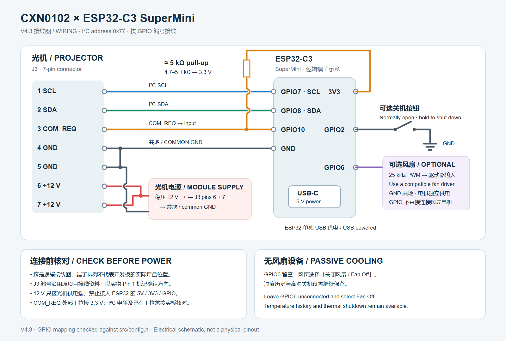

# CXN0102 投影光机 ESP32-C3 SuperMini 控制器

[English README](README.md) · [最新 V4.3 源码与固件](v4.3/) · [V4.3 接线图](figures/Esp32c3_supermini_wiring_v4.3.svg) · [历史图片](figures/README.md)

这是一个面向 CXN0102 投影光机的开源 Wi-Fi/I²C 控制器，运行于 ESP32-C3 SuperMini。V4.3 提供自适应中英文网页、光机控制、状态监测、可配置高温关机和可选风扇控制。

> [!IMPORTANT]
> 本项目完全开源，不需要许可证。条件允许时推荐使用微雪 ESP32-C3-Zero/迷你开发板。部分低价 SuperMini 兼容板的天线匹配较差，接线前也必须核对实际 GPIO 标记。

> [!WARNING]
> `COM_REQ` 看起来是开漏输出。GPIO10 应连接外部上拉电阻，约 **5 kΩ** 已验证可用。如果 `COM_REQ` 不工作，普通 I²C 控制和定时查询仍可使用，但可能收不到光机主动异步通知。

## V4.3 网页



## V4.3 主要功能

- 手机和电脑均可使用的自适应中英文网页。
- 开始、停止、重启、关机及可选开机自动开始。
- 梯形校正、画面翻转、光轴与双相位调整。
- 画质控制、内置测试图案和经过长度检查的自定义 I²C 指令。
- AP/STA Wi-Fi 模式和多网络保存管理。
- 最近一小时光机温度与 ESP32-C3 芯片温度曲线。
- 可设置阈值的高温自动关机，连续两次有效超限才执行。
- 静音、正常、激进、自动、全速、自定义曲线、PID 和 PID 自动整定。
- 面向单散热片设备的“关闭风扇”模式；温度记录与高温关机继续运行。
- 显示光机温度阈值、累计运行时间、固件/参数/数据版本、LOT 和序列号。
- EEPROM/NVS 设置持久化。
- ESP32-C3 运行在 80 MHz，并优化 Wi-Fi 功耗。

固件编译及网页模拟测试已通过；COM_REQ 时序、风扇 PWM 和人为升温关机仍需在目标硬件上验收。

## 接线



[下载可编辑 SVG](figures/Esp32c3_supermini_wiring_v4.3.svg)。这是逻辑接线图，不代表实物焊盘排列；实心圆表示连接，跨线弧表示交叉但不相连。J3 编号沿用原项目资料，接线时请对照实物确认 Pin 1 方向。[原始接线图](figures/Esp32c3_supermini_wiring.png) 已原样保留。

| ESP32-C3 引脚 | 功能 |
|---|---|
| GPIO8 | I²C SDA |
| GPIO7 | I²C SCL |
| GPIO10 | COM_REQ 输入，建议外接上拉 |
| GPIO2 | 长按关机按钮，低电平有效 |
| GPIO6 | 25 kHz 风扇 PWM 输出 |

V4.3 使用的光机 I²C 地址为 `0x77`。上电前请根据实际控制板确认电平、共地和引脚标记。

## 首次连接

刷写并重启 ESP32-C3 后：

1. 连接 Wi-Fi：`CXN0102_Web_Controller_Silver`。
2. 默认密码：`12345678`。
3. 浏览器打开 `http://192.168.4.1/`。
4. 如需接入路由器，在无线网络区域保存网络并切换到 STA 模式。

网页控制器没有用户身份验证。不要直接暴露到公网；正式使用前如不适合使用默认热点密码，请在源码中修改后重新构建。

## 刷写 V4.3 预编译固件

### 简单方式：合并固件

使用乐鑫 [Flash Download Tool](https://docs.espressif.com/projects/esp-test-tools/en/latest/esp32/production_stage/tools/flash_download_tool.html)，也可以使用仓库 [`download_tool`](download_tool/) 中保存的工具。

选择 `ESP32-C3` 和 `UART`，然后刷写：

| 文件 | 地址 |
|---|---:|
| [`v4.3_merged_0x0.bin`](v4.3/bin/v4.3_merged_0x0.bin) | `0x0` |

合并固件已包含 bootloader、分区表、程序和 SPIFFS 网页。刷写合并固件可能清除以前保存的控制器设置。

### 高级方式：分别刷写

| 文件 | 地址 |
|---|---:|
| [`bootloader.bin`](v4.3/bin/bootloader.bin) | `0x0` |
| [`partitions.bin`](v4.3/bin/partitions.bin) | `0x8000` |
| [`firmware.bin`](v4.3/bin/firmware.bin) | `0x10000` |
| [`spiffs.bin`](v4.3/bin/spiffs.bin) | `0x290000` |

可用 [`SHA256SUMS.txt`](v4.3/bin/SHA256SUMS.txt) 校验下载文件。不要把单独的 `firmware.bin` 刷到 `0x0`；只有合并固件才能使用 `0x0` 地址。

## 从源码构建

安装 [Visual Studio Code](https://code.visualstudio.com/) 和 PlatformIO 插件，或者安装 PlatformIO Core。在 `v4.3` 目录执行：

```bash
pio run
pio run -t buildfs
```

使用 PlatformIO 上传程序和网页：

```bash
pio run -t upload
pio run -t uploadfs
```

目标环境为 `esp32-c3-devkitm-1`、Arduino 框架、4 MB Flash、DIO 模式和 SPIFFS。完整配置见 [`v4.3/platformio.ini`](v4.3/platformio.ini)。

## 温度安全说明

- 高温自动关机默认关闭，需要用户确认阈值后主动启用。
- 默认参考阈值为光机 70°C、ESP32-C3 芯片 85°C。
- 第一次有效超限时，有风扇的设备会请求全速输出；连续两次有效超限后执行 `Stop → Shutdown`。
- “关闭风扇”模式始终保持 PWM 为 0，但温度采样、历史和自动关机不会停止。
- ESP32-C3 传感器测量的是芯片内部温度，不是环境温度或外壳温度。
- 软件只能发送光机关机指令，不能物理切断光机电源。

更多实现和验证说明见 [`v4.3/POWER_V4.3.md`](v4.3/POWER_V4.3.md)。

## 仓库结构

| 路径 | 内容 |
|---|---|
| [`v4.3/`](v4.3/) | 当前源码、网页、测试和预编译固件 |
| [`v4.2/`](v4.2/) | 上一版网页控制器 |
| [`v3.4/`](v3.4/) | 早期 PlatformIO 源码版 |
| [`v3.0/`](v3.0/)–[`v3.2/`](v3.2/) | 历史二进制版本 |
| [`figures/`](figures/) | 接线图和网页截图 |
| [`download_tool/`](download_tool/) | 留存的刷写工具 |

## 版本历史

| 版本 | 主要变化 |
|---|---|
| V4.3 | 模块化固件、80 MHz 功耗优化、Wi-Fi 改进、自适应双语网页、光机/ESP32 温度历史、可配置高温关机、完整风扇控制和无风扇模式 |
| V4.2 | 网页控制、设置持久化和 SPIFFS 界面 |
| V3.4 | PlatformIO 源码和协议文档 |
| V3.2 | GPIO2 关机按钮 |
| V3.1 | 中文界面和接线调整 |
| V3.0 | 自定义 I²C 指令与 Wi-Fi 发射功率控制 |

## 许可证

见 [`LICENSE`](LICENSE)。欢迎提交改进和实机测试结果。
